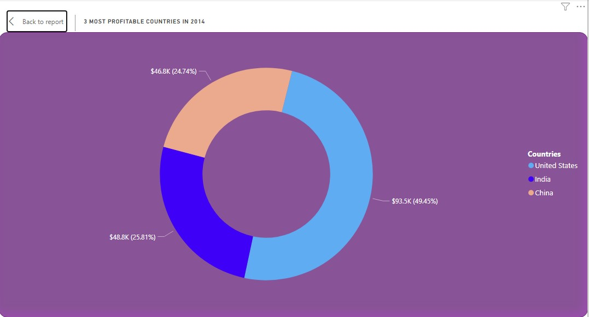
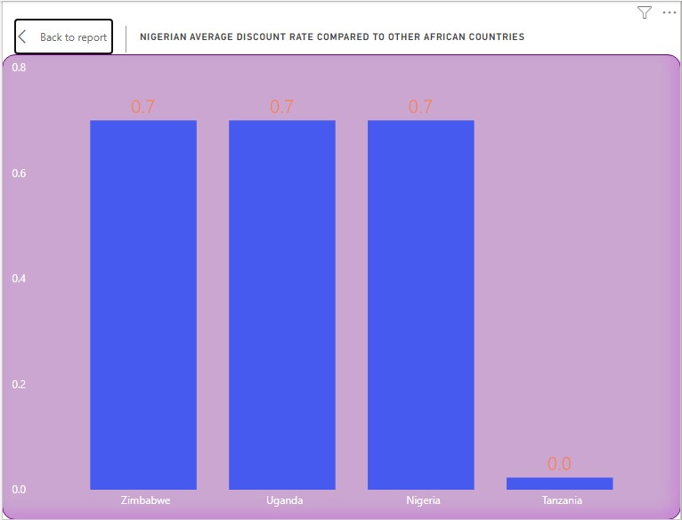

# Global Super Stores Sales Report (2011-2015)

## Introduction
This report presents the results of a data analysis on the Superstore dataset, which contains information about the sales and profits of Global Superstore, an online retailer that operates in 147 countries and sells 3,788 products in various categories.

**Excel Concepts applied:**
- Custom Column, Unique(), Counta().

**Power BI Concepts applied:**
- DAX Concepts: Calculated column, Custom Column, CALENDARAUTO(), Year(), Month(), Format().
- Data Modelling: Star Schema (*:1).

## Problem Statement
- What are the three countries that generated the highest total profit for Global Superstore in 2014?
- What are the top 3 subcategories with the highest average shipping cost in the United States?
- Compare Nigeria profitability in respect to other African countries while investigating the result.
- Which product subcategory is the least profitable in Southeast Asia?
- Which city is the least profitable (in terms of average profit) in the United States? 
- Which product subcategory has the highest average profit in Australia?
- Which of our customers are most valuable?
 
## Data Sourcing
The data used for this analysis was given by Ruby Ihekweme (Mentor at Digitaley NG).

It contains 3 sheets/tables:

1. ORDERS with 51,291 rows and 24 columns
2. PEOPLE with 24 rows and 2 columns
3. RETURNS with 1079 rows and 3 columns

## Data Transformation/Cleaning
Data was efficiently cleaned and transformed with the Power Query Editor of Power BI and excel. 
- Extrated Unique Order ID from the oder table in Excel, =UNIQUE(Orders!B2:B51291)
- Also extrated Unique Customer names from the oder table in Excel, =UNIQUE(Orders!G2:G51291)
- Making first row as headers in the PEOPle and RETURN tables.
- From the order data, we noticed that more than 80% of the postal code values were missing, so we discarded that column. - Corrected the data types for the date columns and changed them to date format. 
- Applied the currency format to the columns that represented monetary values, such as shipping cost, profit, discount, and sales. 

## Data Modelling
Power BI automatically connected related tables resulting in a star schema model. The 'Order' table is the fact table of the model. The remaining two dimension tables; 'Return' table and 'Calender' tables are connected to the 'Order' table via the common columns: 'order ID' and Date respectively.
 

## Data Analysis and Visuals
**DASHBOARD 1**

**DASHBOARD 2**

**DASHBOARD 3**

**1. What are the three countries that generated the highest total profit for Global Superstore in 2014?**

 

Despite generating a total profit of $504.2K in 2014, Global Superstore's profit distribution was uneven across countries. In fact, only three countries accounted for nearly half of the company's total profit. These Countries are :
- United States with total profit of $93.5
- Followed by India with $48.8
- And Lastly, China with the total profit of $46.8 

This suggests that Global Superstore's performance varies across different countries. It is important for the store to identify the factors that contribute to its success in certain markets and replicate these factors in other markets.

Also, the top 3 products for each of these countries is shown below:

 **2. What are the top 3 subcategories with the highest average shipping cost in the United States?**

Shipping cost is a key factor that affects a business's profitability. We examines the average shipping cost for every sub-categories, in the United States from 2011 to 2015.

From the Analysis:

- Tables had the lowest average shipping cost among the three subcategories from 2011 to 2015, with an average of $70 per order.
- Machines had an average shipping cost of $132 per order.
- Copiers had the highest average shipping cost, at $165 per order.

These findings suggest that copiers are more expensive to ship than tables and machines. This could be due to a number of factors, such as the weight and dimensions of copiers, the need for special packaging to protect them from damage during shipping, and the use of specialized shipping carriers.

**3. Compare Nigeria profitability in respect to other African countries while investigating the result.**

The chart shows the profits of different African countries in 2014. Most countries had a positive profit, but three had a negative profit. South Africa had the highest profit, followed by Morocco, Egypt, and the Democratic Republic of Congo. Senegal, Algeria, Tanzania, Ghana, Sudan, Cote d'Ivoire, and Mozambique also had positive profits, but lower than the top four. Nigeria had the biggest negative profit, followed by Zimbabwe and Uganda. These three countries were underperforming compared to the rest of the continent.

In other to acertain the causes of Nigeria's underperformance, we investigated the quantities demanded, average shipping cost and average discount rate paying close attention to know Nigerian performance there.

**Quantities Demanded**

**Average Shipping Cost**

**Average Discount Rate**

From the charts above, 905 quantities of product was demanded in Nigeria, far greater than other African Countries. The second chart showed that Nigeria, Zimbabwe and Uganda which exhibit negative profit all have the average discount rate of 70% per order. This means that **Global Super Store** selling there product in these countries are incurring losses.  The high discount rate may contribute to negative profit margins, as it significantly reduces the revenue generated per sale. Also, the shipping cost to Nigeria per order is $6.8 which is relatively low compared to some African countries which could also explain why Nigeria has the highest quantity of products demanded. 

**4. Which product subcategory is the least profitable in Southeast Asia?**

Based on our analysis product subcategories in Southeast Asia that least profitable are table with the profit of -19k followed by supplies (-4k), envelopes, (-2k), fasteners (-2k) and Labels (-1k). 

**5. Which city is the least profitable (in terms of average profit) in the United States?**

The chart shows the average profit of different cities in the USA. More than 10 cities are underperforming and have a negative average profit. The worst performers are Charlotte, Philadelphia, and Concord, with average profits of -$0.3K, -$0.5K, and -$1.9K respectively.

**6. Which product subcategory has the highest average profit in Australia?**

The subcategory products that generate the most profit in Australia are appliances, copiers and phones, according to the chart above. These products have an average profit of $139, $105 and $98 per unit, respectively, which are significantly higher than the other subcategories

**7. Which of our customers are most valuable?**

To identify the most valuable customers in our sales data, we used the total number of quantities demanded to rank them. We found that the most valuable customers based on our mood of selection are:

- **Steve Ward:** demanded 106 quantities of different products but most of the product he demanded are from the Fastners and Blinders categories.
- **Bill Eplett:** demanded 102 quantities of different products but most of the product he demanded are from the Paper and Blinders categories. 
- **Gary Hawng:** demanded 102 quantities of different products but most of the product he demanded are from the Art and Blinders categories.
- **Eric Murdock** demanded 100 quantities of different products but most of the product he demanded are from the Storage and Art categories.

